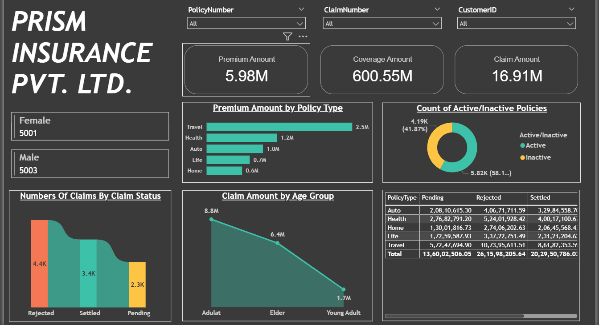

# 📊 Insurance Data Analysis Dashboard

## 📌 Project Overview

This project is an Insurance Data Analysis Dashboard built for Prism Insurance Pvt. Ltd.
It provides end-to-end insights into insurance operations, including policy performance, claims management, customer demographics, and premium distribution.

The goal of this project is to help insurance companies make data-driven decisions by analyzing trends in claims, coverage, and premiums.

---

## ⚙️ ETL Process

The data pipeline for this project follows the ETL (Extract, Transform, Load)process:

1. Extract

   * Data was extracted from SQL Server using SQL queries.
   * Raw data included policy details, claim history, customer demographics, and premium information.

2. Transform

   * Data cleaning and preprocessing performed in SQL Server.
   * Null handling, data type conversions, and aggregations were applied.
   * Business rules were applied to categorize claims (Settled, Pending, Rejected).

3. Load

   * Transformed data was loaded into Power BI for visualization and analysis.

---

## 📈 Key Features of Dashboard

* KPI Metrics: Premium Amount, Coverage Amount, and Claim Amount.
* Customer Demographics: Gender distribution of policyholders.
* Policy Insights: Count of Active vs. Inactive Policies.
* Claims Analysis: Distribution of Settled, Pending, and Rejected claims.
* Policy Type Breakdown: Premium contribution by Travel, Health, Auto, Life, and Home insurance.
* Age Group Trends: Claim amounts segmented by Young Adults, Adults, and Elders.
* Detailed Table View: Pending, Rejected, and Settled claim amounts by policy type.

---

## 🛠️ Tech Stack

* Database: SQL Server
* Data Visualization: Power BI
* ETL Process: SQL (Extract & Transform) + Power BI (Load & Visualization)

---

## 🚀 Insights Derived

* Travel Insurance generates the highest premium contributions.
* Adults have the highest claim amounts compared to elders and young adults.
* A significant number of policies remain inactive (58%), which indicates a retention challenge.
* Most claims are rejected (4.4K) compared to settled (3.4K), highlighting possible policyholder dissatisfaction.

## 📌 Conclusion

This project demonstrates how **ETL pipelines with SQL Server and Power BI** can be leveraged for **insurance data analysis**.
The dashboard enables stakeholders to **monitor performance, identify risks, and optimize decision-making** in insurance operations.

---

👉 Would you like me to also **add SQL query samples** (for extraction & transformation) in this README so that recruiters/others can see your backend work too?

